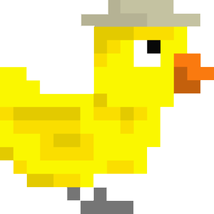
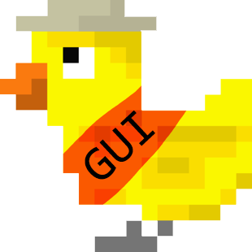

# Documentation

To check out *phaseportrait*'s documentation, view some examples and read more about it, check our website or try our Graphical User Interface:


<a href="https://phaseportrait.github.io/">
<center>

</img>
<!-- </center> -->
</a>
<a href="https://github.com/phaseportrait/phaseportrait-gui">
<!-- <center> -->

</center>
</a>

<center>
<a>https://phaseportrait.github.io/
</a>

<a>https://github.com/phaseportrait/phaseportrait-gui
</a>
</center>


# Examples of use
<a href="https://phaseportrait.github.io/trajectories_examples/">
<center></center>
</a>

<a href="https://phaseportrait.github.io/phaseportrait2d_examples/">
<center></center>
</a>

<a>
<center></center>
</a>

<a href="https://phaseportrait.github.io/mapsandcobweb_examples/">
<center></center>
</a>


# Installation
**Installing via pip:**

Phaseportrait releases are available as wheel packages for macOS, Windows and Linux on PyPI. Install it using pip:
```
$ pip install phaseportrait
```

**Installing from source:**

Open a terminal on desired route and type the following:
```
$ git clone https://github.com/phaseportrait/phaseportrait
```
**Manual installation**

Visit [phase-portrait](https://github.com/phaseportrait/phaseportrait) webpage on GitHub. Click on green button saying *Code*, and download it in zip format.
Save and unzip on desired directory.

# What's this?
The idea behind this project was to create a simple way to make phase portraits in 2D and 3D in Python, as we couldn't find something similar on the internet, so we got down to work. Eventually, we did some work on bifurcations, 1D maps and chaos.

This idea came while taking a course in non linear dynamics and chaos, during the 3rd year of physics degree, brought by our desire of visualizing things and programming.


We want to state that we are self-taught into making this kind of stuff, and we've tried to make things as *professionally* as possible, any comments about improving our work are welcome!

<!-- ## **Disclaimer:**

**Today's date (July 2021), we've decided to cease our work on this project (for the moment, as we have to move on other things). Therefore, this is the 'final' version of the project, there are no more features incoming. We've tried to leave the code documentated and with good organisation in case someone wants to carry on with some idea! Cheers** -->

# Authors

- Víctor Loras Herrero (vhloras@gmail.com)
- Unai Lería Fortea (unaileria@gmail.com)