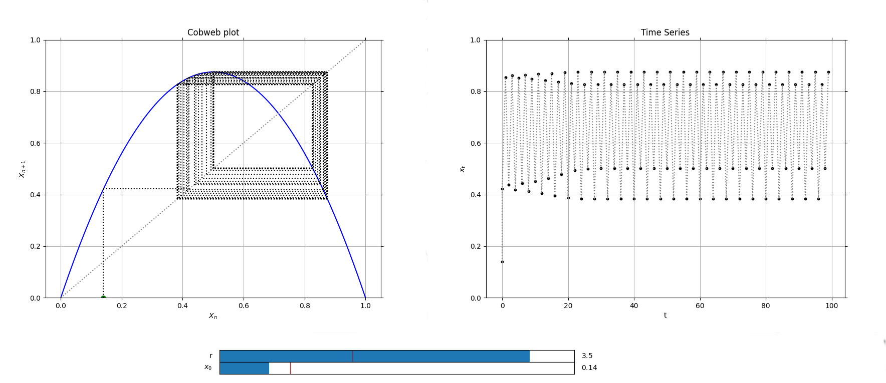

# Cobweb
> *class* phaseportrait.**Cobweb**(*dF, initial_position, xrange, \*, dF_args={None}, yrange=[], max_steps=100, n_points=100, \*\*kargs*)

A class used to represent a Cobweb plot and a time series to study the convergence of a 1D map `x(t+1) = f(x)`.


### **Parameters**

* **dF** : callable

    A dF type funcion.
    
* **initial_position** : float

    Initial x of the iteration.
    
* **xrange** : list

    Range of the x axis in the main plot.
    
### **Key Arguments**

* **dF_args** : dict

    If necesary, must contain the kargs for the `dF` funcion.
    
* **yrange** : list

    Range of the y axis in the main plot
    
* **max_steps** : int, default=100

    Maximum number of points to be represented.
    
* **n_points** : int, default=10000

    Number of points in the bisector. 
    
* **Title** : str, default='Cobweb plot'

    Title of the plot.
    
* **xlabel** : str, default=r'$X_{n}$'

    x label of the plot.
    
* **ylabel** : str, default=r'$X_{n+1}$'

    y label of the plot.
    
# Methods
### *Cobweb*.plot
> *Cobweb*.**plot**(\*args, \*\*kargs)

Creates two figures, one containing the Cobweb plot and other with the time series.

**Returns**

* tuple(matplotlib Figure (Cobweb plot), matplotlib Axis (Cobweb plot), matplotlib Figure (Time series), matplotlib Axis (Time series))

### *Cobweb*.add_slider
> *Cobweb*.**add_slider**(param_name, \*, valinit=None, valstep=0.1, valinterval=10)

Adds a slider which can change the value of a parameter in execution time.

**Parameters**

* param_name : str
    The string key of the variable. Must be the same as the key in the `dF` function.

**Key Arguments**

* valinit : float, default=None

    Initial value of the parameter.
    
* valinterval : Union[float, list], default=0.1

    The range of values the slider of the parameter will cover.
    
* valstep : float, default=10

    Precision in the slider.

**Returns**

* None

### *Cobweb*.initial_position_slider
> *Cobweb*.**initial_position_slider**(\*, valinit=None, valstep=0.05, valinterval=None)

Adds a slider for changing initial value on a cobweb plot.

**Key Arguments**

* valinit : numeric

    Initial position. Default value is the same as initial position given when initializing Cobweb object.

* valinterval : Union[float, list]

    The range of values the slider of the parameter will cover.

* valstep : float

    Precision in the slider.

**Returns**

* None


# Examples

Logistic map cobweb plot and time series, defining the logistic map as a 1D [dF function](dFfunction.md). 
```python
from phaseportrait import Cobweb

def Logistic(x, *, r=1.5):
    return r*x*(1-x)

# Cobweb plot and time series.
LogisticCobweb = Cobweb(Logistic, 0.2, [0,1], dF_args={'r':1.5}, yrange=[0,1])
LogisticCobweb.add_slider('r', valinit=1.5, valinterval=[0,4])
LogisticCobweb.initial_position_slider(valstep=0.01)
LogisticCobweb.plot()
```

This will output the following plots:



* [See more Cobweb examples.](mapsandcobweb_examples.md)

