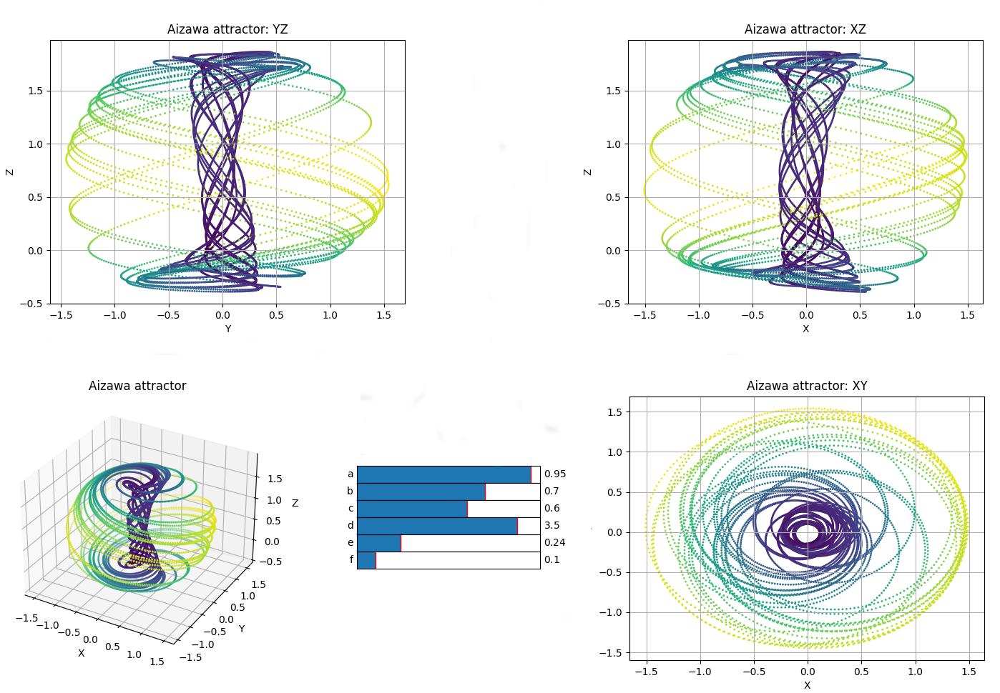
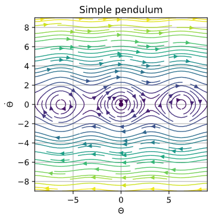
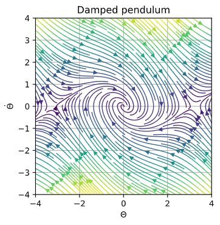
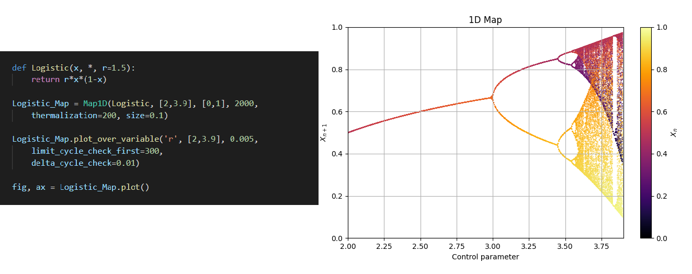

# What's this?
The idea behind this project was to create a simple way to make phase portraits in 2D and 3D, as we couldn't find something similar on the internet, so we got down to work. Eventually, we did some work on bifurcations, 1D maps and chaos.

This idea came while taking a course in non linear dynamics and chaos, during the 3rd year of physics degree, brought by our desire of visualizing things and programming.

We want to state that we are self-taught into making this kind of stuff, and we've tried to make things as *professionally* as possible, any comments about improving our work are welcome!

At first, this project was made up in spanish. The spanish version can be found [here](https://github.com/Loracio/retrato-de-fases).

### **Disclaimer:**

As of today (July 2021), **we've decided to cease our work on this project** (for the moment, as we have to move on other things). Therefore, **this is the 'final' version** of the project, there are no more features incoming. We've tried to leave the code documentated and with good organisation in case someone wants to carry on with some new ideas! Cheers

# Authors

- Víctor Loras Herrero  ([vhloras@gmail.com](mailto:vhloras@gmail.com)) ([GitHub](https://github.com/Loracio))
- Unai Lería Fortea ([unaileria@gmail.com](mailto:unaileria@gmail.com)) ([GitHub](https://github.com/QuanticPony))

# Examples of use

In Tutorials tab, we've prepared some introduction to the classes contained in phaseportrait's module.

Some more examples can be found on the GitHub repository.

- [examples.ipynb](https://github.com/phaseportrait/phaseportrait/tree/master/examples/examples.ipynb):
examples showing how to use *PhasePortrait2D* class.

- [sliderExamples.py](https://github.com/phaseportrait/phaseportrait/tree/master/examples/sliderExamples.py) :
examples using the *slider* feature from *PhasePortrait2D* class.

- [TrajectoryExamples.py](https://github.com/phaseportrait/phaseportrait/tree/master/examples/TrajectoryExamples.py):
contains examples of 2D and 3D trajectories with and without sliders.

- [mapExamples.py](https://github.com/phaseportrait/phaseportrait/blob/master/examples/mapExamples.py): contains examples of the most famous cobweb plots and 1D maps.

  

