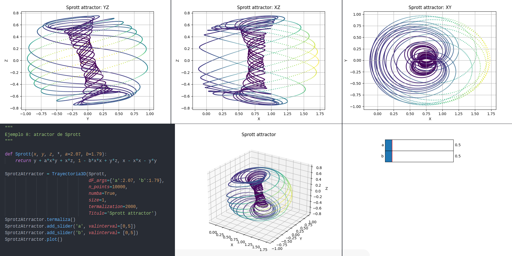

# What's this?
The idea behind this project was to create a simple way to make phase portraits in 2D and 3D, as we couldn't find something similar on the internet, so we got down to work. Eventually, we did some work on bifurcations, 1D maps and chaos.

This idea came while taking a course in non linear dynamics and chaos, during the 3rd year of physics degree, brought by our desire of visualizing things and programming.

We want to state that we are self-taught into making this kind of stuff, and we've tried to make things as *professionally* as possible, any comments about improving our work are welcome!

At first, this project was made up in spanish. The spanish version can be found [here](https://github.com/Loracio/retrato-de-fases).
# Authors

- Víctor Loras Herrero  ([vhloras@gmail.com](mailto:vhloras@gmail.com))
- Unai Lería Fortea  ([unaileria@gmail.com](mailto:unaileria@gmail.com))

# Installation
**Installation via pip:**

> $ pip install phaseportrait

**Installation via git:**

Open a terminal on desired route and type the following
> $ git clone https://github.com/Loracio/phase-portrait

**Manual installation**

Visit [phase-portrait](https://github.com/Loracio/phase-portrait) webpage on GitHub. Click on green button saying *Code*, and download it in zip format.
Save and unzip on desired directory.

# Examples of use

- [examples.ipynb](https://github.com/Loracio/phase-portrait/examples/examples.ipynb):
Examples showing how to use *PhasePortrait2D* class.

- [sliderExamples.py](https://github.com/Loracio/phase-portrait/examples/sliderExamples.py) :
Examples using the *slider* feature from *PhasePortrait2D* class.

- [TrajectoryExamples.py](https://github.com/Loracio/phase-portrait/examples/TrajectoryExamples.py):
Contains examples of 2D and 3D trajectories with and without sliders.
