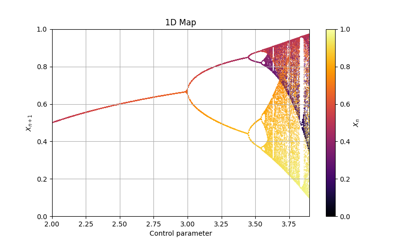

# Map1D
> *class* phaseportrait.**Map1D**(*dF, x_range, y_range, n_points, \*, composition_grade=1, dF_args={}, Title='1D Map', xlabel=r'Control parameter', ylabel=r'$X_{n+1}$', \*\*kargs*)

Class dedicated to 1 dimensional maps `x(t+1) = f(x)`.


### **Parameters**

* **dF** : callable

    A dF type function.

* **Range** : [x_range, y_range]

    Ranges of the axis in the main plot.

* **n_points** : int

    Maximum number of points. Not recomended more than 5000.

### Key Arguments

* **dF_args** : dict
    
    If necesary, must contain the kargs for the `dF` function.

* **composition_grade** : int
    
    Number of times `dF` is applied between positions saved.

* **Title** : str
    
    Title of the plot.

* **xlabel** : str

    x label of the plot.

* **ylabel** : str
    
    y label of the plot.

* **color** : str
    
    Matplotlib `Cmap`.

* **size** : float

    Size of the scattered points.

* **thermalization** : int

    Thermalization steps before points saved.

# Methods

### *Map1D*.plot_over_variable
> *Map1D*.**plot_over_variable**(param_name, valinterval, valstep, \*, initial_x=None, limit_cycle_check_first=50, delta_cycle_check=0.0001)

Creates every `map` instance.

**Parameters**

* **param_name** : str

    Name of the variable. Must be in the `dF` kargs.

* **valinterval** : list

    Min and max value for the param range.

* **valstep** : float

    Separation between consecutive values in the param range.

**Key Arguments**


* **initial_x** : float

    Initial x position of every data series.

* **limit_cycle_check_first** : int

    Number of points saved before checking for repeated elemets.

* **delta_cycle_check** : float

    Diference between two positions to be considerated identical.

**Returns**

* None


### *Map1D*.update_dF_args
> *Map1D*.**update_dF_args**()

Updates the internal dF_args attributes to match the sliders.

### *Map1D*.plot
> *Map1D*.**plot**(\*, color=None)

Prepares the plots and computes the values.

**Key Arguments**

* **color** : str

    Matplotlib `Cmap`.

**Returns**

* tuple(matplotlib Figure, matplotlib Axis)


### *Map1D*.add_slider
> *Map1D*.**add_slider**(param_name, \*, valinit=None, valstep=0.1, valinterval=10)

Adds a `Slider` for the `dF` function.
    

**Parameters**

* **param_name** : str

    Name of the variable. Must be in the `dF` kargs of the `Map1D.dF`function.
        
**Key Arguments**


* **valinit** : float, defautl=None

    Initial position of the Slider

* **valinterval** : Union[float,list], default=10

    Min and max value for the param range.

* **valstep** : float, default=0.1

    Separation between consecutive values in the param range.


### *Map1D*.plot_trajectory
> *Map1D*.**plot_trajectory**(n_points, \*, dF_args=None, initial_x=None, color='b', save_freq=1, thermalization=0)

Creates a `map` instance and computes it's positions.
    

**Parameters**

* **n_points** : int

    Number of points to be calculated.
            

**Key Arguments**

* **dF_args** : dict

    If necesary, must contain the kargs for the `dF` function. By default takes the dF_args of the `Map1D` instance.

* **initial_x** : float

    Initial position of the trajectory.

* **color** : str

    String  matplotlib color identifier.

* **save_freq** : int

    Number of times `dF` is aplied before a position is saved.

* **thermalization** : int

    Thermalization steps before points saved.

**Returns**

* tuple: `(matplotlib.pyplot.figure, matplotlib.pyplot.Axis)`

# Examples

### Logistic map

Let's represent the Logistic map over the control parameter **r**, in the range `[2, 3.9]`, with an interval of `0.005`.

```py
def Logistic(x, *, r=1.5):
    return r*x*(1-x)

Logistic_Map = Map1D(Logistic, [2,3.9], [0,1], 2000, thermalization=200, size=0.1)

# We add a limit cycle check because until r=3.5 there is not need of storing 2000 equal points for every r.

Logistic_Map.plot_over_variable('r', [2,3.9], 0.005, 
    limit_cycle_check_first=300, delta_cycle_check=0.01
    )

fig, ax = Logistic_Map.plot()
```


* [See more Map1D examples.](mapsandcobweb_examples.md)

