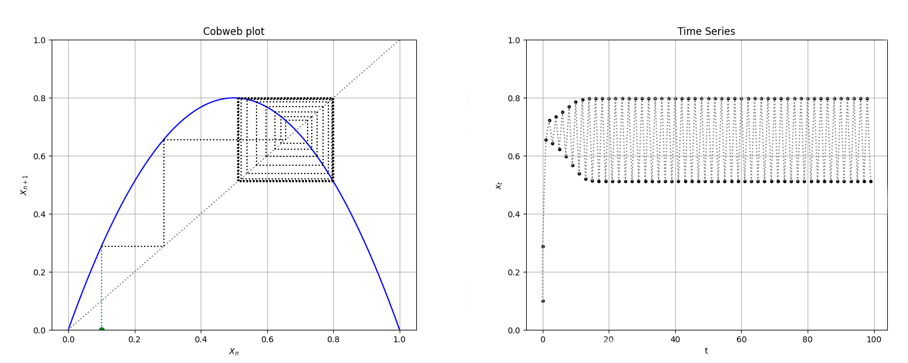
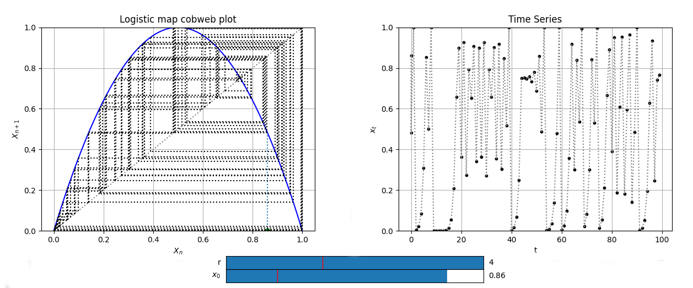
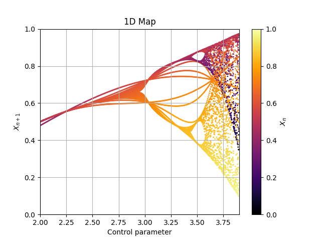
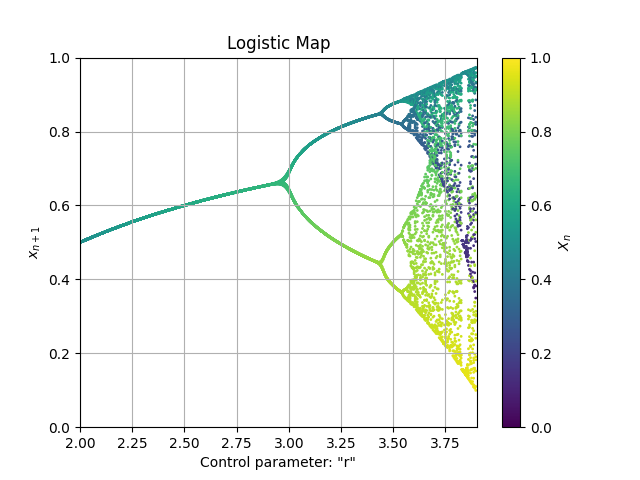
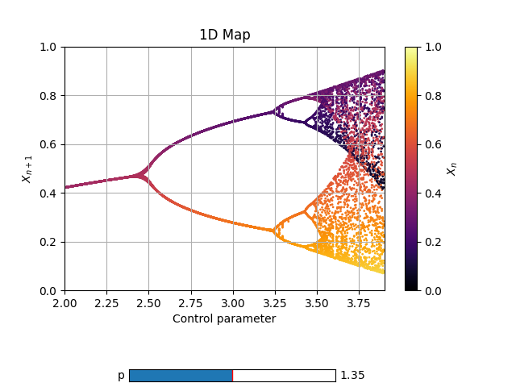
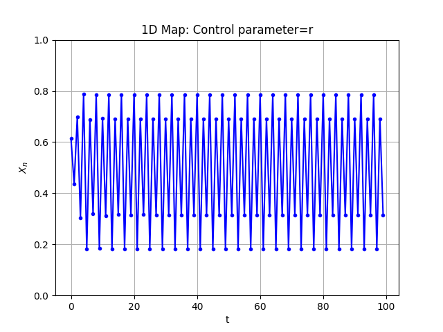

# Cobweb plots

## Logistic map

Let's say we want to investigate the qualitative behavior of the logistic map using a cobweb plot to infer the long term status of an initial condition under repeated application of the map.

[Cobweb](cobweb.md) class takes 3 arguments:

* **dF** : In our case, the logistic map.
    
* **initial_position** : initial condition to study.
    
* **xrange** : range of representation in the x axis.

An interesting optional argument is `max_steps`, which indicates the number of iterations of the map. Its default value is `100`, which is more than enough, but you can change it if you want. 

We can also restrict the yrange by using `yrange` kwarg, as we know the output will be in the range [0,1]. If not included, the yrange is `1.10` times the maximum and minimum, ergo, [1.10 × min, 1.10 × max].

Plot method also yields a time series plot, which shows explicitly the values taken, and it returns the two figures and axes (first cobweb plot, then time series). We get two birds with one stone.

Let's see what output we get:

```py
from phaseportrait import Cobweb

def Logistic(x, *, r=3.2):
    return r*x*(1-x)

LogisticCobweb = Cobweb(Logistic, 0.1, [0,1], yrange=[0,1])
fig1, ax1, fig2, ax2 = LogisticCobweb.plot()
```



We can use returned objects to change plot's properties, such as title, xlabel, ylabel... We can also pass `Title`, `xlabel` and `ylabel` as key arguments when creating the *Cobweb* object instance for changing the cobweb plot's labels, but not the time series plot.

## Adding sliders

The point of cobweb plots and time series is to study the behaviour of the map for several values of a parameter and initial conditions. Let's see two methods that will let us change this values in a simple way.

* **Parameter slider**:

Let's say we want to study the logistic map as `r` control parameter value changes with a cobweb plot. We can use the `add_slider` method for this purpose. It only takes 1 argument: the parameter's name, in this case `r`.

We can also pass `valinit` and `valinterval` kargs for changing the initial value and the interval of variation.

* **Initial position slider**:

Following the same philosophy as the parameter slider, `initial_position_slider` takes no necessary arguments.

Nevertheless, it has 3 optional arguments:

* valinit : initial position in the slider. Default value is the same as initial position given when initializing Cobweb object.
* valinterval : the range of values the slider of the parameter will cover.
* valstep : *precision* or *step* in the slider.

Let's put all in practice with the following example:

```py
from phaseportrait import Cobweb

def Logistic(x, *, r=1.5):
    return r*x*(1-x)

LogisticCobweb = Cobweb(Logistic, 0.2, [0,1], yrange=[0,1], Title='Logistic map cobweb plot')

LogisticCobweb.add_slider('r', valinit=1.5, valinterval=[0,4])
LogisticCobweb.initial_position_slider(valstep=0.01)

fig1, ax1, fig2, ax2 = LogisticCobweb.plot()

ax2.set_title('Logistic map time series')
```


# Map1D plots

Complete documentation of Map1D class: [here](map1d.md).

## First steps

We are going to plot the Logistic map:

Just like Cobweb plots, the first argument is a `dF` function ([dF function documentation](dFfunction.md)). The next required parameters are:
* x_range : in this example `[2,3.9]`.
* y_range : in this example `[0,1]`.
* n_points : in this example `2000`.

We want the plot over the control parameter in the range `x_range=[2,3.9]` with data every `0.005`:

```py
def Logistic(x, *, r=1.5):
    return r*x*(1-x)

Log1 = Map1D(Logistic, [2,3.9], [0,1], 2000, Title='Logistic Map', xlabel='Control parameter: "r"', ylabel=r'$x_{n+1}$', size=1.0)

Log1.plot_over_variable('r', [2,3.9], 0.005)

fig, ax = Log1.plot()
```


As you can see, this is a mess. That happended because the first steps are not in a stable cycle, and must be deleted.

## Thermalization

Same example, but with 50 steps of thermalization:

```py
Log2 = Map1D(Logistic, [2,3.9], [0,1], 2000, thermalization=50, Title='Logistic Map', xlabel='Control parameter: "r"', ylabel=r'$x_{n+1}$', color='viridis')

Log2.plot_over_variable('r', [2,3.9], 0.005)

fig, ax = Log2.plot()
```


Note: in some cases the graph is very dependant of the initial position. In the method `plot_over_variable` there is a karg for specifying the initial position: `plot_over_variable(initial_x=... )`.


## Sliders

Just like the Cobweb plots you can add sliders so modify in run time some parameters. For instance:

```py
def Logistic_power(x, *, r=1.5, p=1):
    return r*x*(1-x)*(x-p)*(x-p)

Log3 = Map1D(Logistic_power, [2,3.9], [0,1], 2000, thermalization=50)
Log3.add_slider('p', valinit=1.35, valinterval=[1.3,1.4], valstep=0.005)
Log3.plot_over_variable('r', [2,3.9], 0.005)

fig, ax = Log3.plot()
```



## Time series

Additionally, you can also plot a specific trajectory. Although we recommend using Cobweb plots for that:

```py
Log4 = Map1D(Logistic_power, [2,3.9], [0,1], 2000, thermalization=50)
Log4.plot_trajectory(100, dF_args={'r':3.40, 'p':1.35}, initial_x=0.5)
fig, ax = Log4.plot()
```



# Some more examples

If you want to take a look to some more plots, we recommend you taking a look to the [following file](https://github.com/phaseportrait/phaseportrait/blob/master/examples/mapExamples.py).