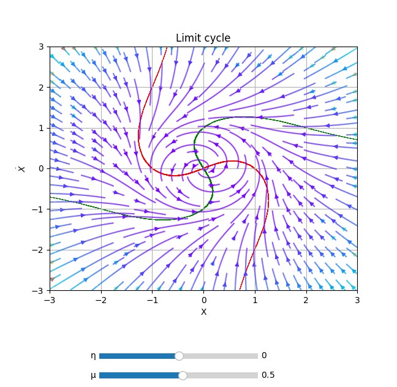

# PhasePortrait2D
*class* phaseportrait.**PhasePortrait2D**(*dF, Range, \*, MeshDim=10, dF_args={}, Density=1, Polar=False, \*\*kargs*)

Gives the option to represent a 2D phase portrait given a [dF](dFfunction.md) function with 2 args.


### **Parameters**

* **dF** : callable

    A dF type funcion. Computes the derivatives of given coordinates.
  
* **Range** : [x_range, y_range]

    Ranges of the axis in the main plot. See [Defining Range](#defining-range).
  
### **Key Arguments**

* **MeshDim** : int, default=500

    Number of elements in the arrows grid.

* **dF_args** : dict

    If necesary, must contain the kargs for the `dF` function.

* **Density** : float, default=1

    Number of elements in the arrows grid plot.

* **Polar** : bool, default=False

    Whether to use polar coordinates or not.

* **Title** : str, default='Phase Portrait'

    Title of the plot.

* **xlabel** : str, default='X'

    x label of the plot.

* **ylabel** : str, default='$\dot{X}$' 

    y label of the plot.

* **color** : str, default='rainbow'

    Matplotlib `Cmap`.


# Methods
### *PhasePortrait2D*.plot
> *PhasePortrait2D*.**plot**(*\*, color=None*)

Prepares the plots and computes the values.. Color scheme can be changed introducing key argument `color`. A list with accepted values can be found [here](https://matplotlib.org/stable/gallery/color/colormap_reference.html). 

**Returns**

* tuple(matplotlib Figure, matplotlib Axis)


### *PhasePortrait2D*.add_slider
> *PhasePortrait2D*.**add_slider**(*param_name, \*, valinit=None, valstep=0.1, valinterval=10*)

Adds a slider which can change the value of a parameter in execution time.

**Parameters**

* param_name : str

    The string key of the variable. Must be the same as the key in the `dF` function.

**Key Arguments**

* valinit : float, default=None

    Initial value of the parameter.
    
* valinterval : Union[float, list], default=0.1

    The range of values the slider of the parameter will cover.
    
* valstep : float, default=10

    Precision in the slider.

**Returns**

* None

### *PhasePortrait2D*.add_nullclines
> *PhasePortrait2D*.**add_nullclines**(*\*, precision=0.01, offset=0, density=50, xRange=None, yRange=None, dF_args=None, xcolor='r', ycolor='g', bgcolor='w', alpha=0*)


Plots nullclines of the system given by dF function. For more info, see [Nullclines](nullclines.md) class.

**Returns**

* None

# Defining Range

1. A single number. In this case the range is defined from zero to the given number in both axes.

2. A range, such `[lowerLimit , upperLimit]`.  Both axes will take the same limits.

3. Two ranges, such that `[[xAxisLowerLimit , xAxisUpperLimit], [yAxisLowerLimit , yAxisUpperLimit]]`

# Examples

```python
from phaseportrait import PhasePortrait2D

def dF(r, θ, *, μ=0.5,η=0):
    return μ*r*(1 - r*r), 1+η*θ


example = PhasePortrait2D(dF, [-3, 3], Density=2, Polar=True, Title='Limit cycle')
example.add_slider('μ', valinit=0.5)
example.add_slider('η', valinit=0.0)
example.add_nullclines()
example.plot()
``` 



* [Click here to see more examples.](phaseportrait2d_examples.md)