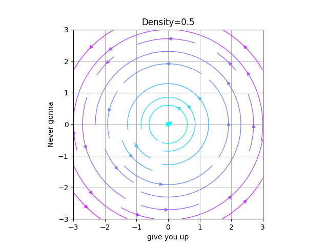
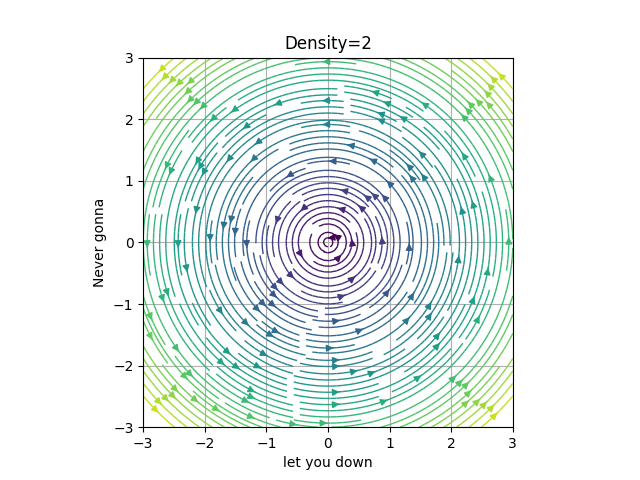
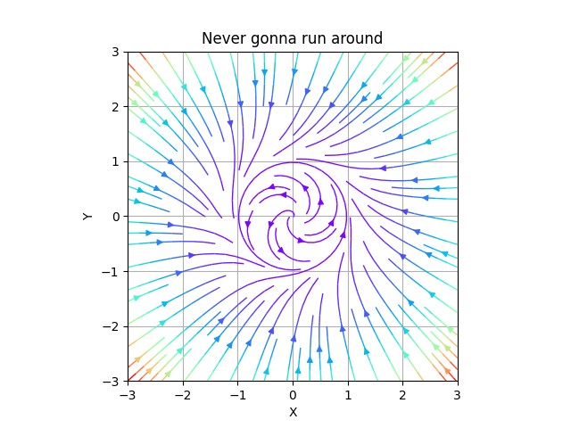
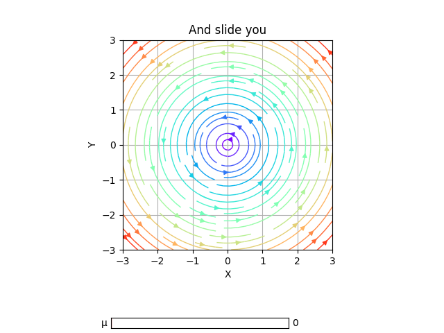
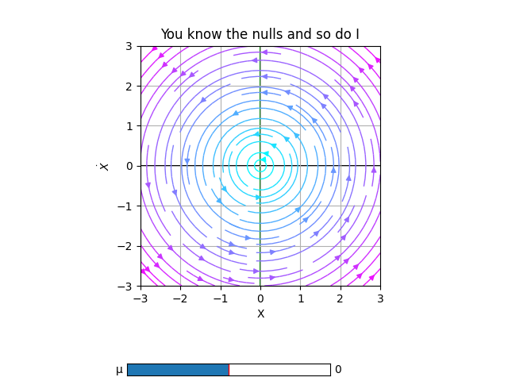

## First steps

In this examples, we will be using [PhasePortrait2D](phaseportrait2d.md) class. So, we'll have to import it from *phaseportrait* module:

```py
from phaseportrait import PhasePortrait2D
```

Let's take a look to the class. *PhasePortrait2D* takes 2 args:

* [dF function](dFfunction.md) : a function that, in this case, returns a tuple, corresponding of the evolution of the 2 coordinates.

* Range, which can be given as:
    1. A single number. In this case the range is defined from zero to the given number in both axes.
    2. A range, such `[lowerLimit , upperLimit]`. Both axes will take the same limits.
    3. Two ranges, such that `[[xAxisLowerLimit , xAxisUpperLimit], [yAxisLowerLimit , yAxisUpperLimit]]`


So, to create an instance of a *PhasePortrait2D* object, we will have to create a dF function and select a range.

For having a simple starting point, let's crate a simple dF function and see the result:

```py
def dF_1(x, y):
    return x, 0

example1 = PhasePortrait2D(dF_1, [-3, 3])
fig, ax = example1.plot()
```


Color shows the speed of the trajectory, as we can see, far away points from (0,0) have a greater velocity. Purple shifted colors show less velocity than red shifted colors in the default color scheme. Color scheme can be changed introducing kwarg *color* when creating the class instance. A list with accepted values can be found [here](https://matplotlib.org/stable/gallery/color/colormap_reference.html). Later, we'll do a pair of examples changing the color scheme.

Let's explore all options given by *PhasePortrait2D* class by doing some more examples.

## Title and labels

Title and labels of the plot can be changed by calling the corresponding key arguments. For instance, using the dF function created in the first example:

```py
example2 = PhasePortrait2D(dF_1, [-3, 3], Title='This is a title', xlabel='This is not a title', ylabel='Neither is this')
fig, ax = example2.plot()
```


There is also, another way of doing it, using the *ax* class methods:

```py
example2 = PhasePortrait2D(dF_1, [-3, 3])
fig, ax = example2.plot()

ax.set_title('This is a title')
ax.set_xlabel('This is not a title')
ax.set_ylabel('Neither is this')
```

That will yield to the same result.

If not specified, default values are:

* Title : 'Phase Portrait'

* xlabel : 'X'

* ylabel : r'$\dot{X}$'

## LaTeX in Title and labels

Using *r strings*, LaTeX-like syntax can be used for writing titles and axis labels.

```py
example2 = PhasePortrait2D(dF_1, [-3, 3], Title=r'You can use some $\left[ LaTeX \right]$ language', xlabel=r'$\Delta t$', ylabel=r'$\~{duck}$')
fig, ax = example2.plot()
```


## Polar and color

Let's say we want to study the phase portrait of a system which is given in polar coordinates. `Polar` argument is used in this cases.

```py
def dF_polar(x, y):
    return 0, 1

example2 = PhasePortrait2D(dF_polar, [-3, 3], Title='Polar plot', xlabel='This is meaningless', ylabel='Why are we here?', Polar=True, color='inferno')
fig, ax = example2.plot()
```


## Density

In order to increase the number of the arrows we modify the `Density` (by default 1). 

**Be careful, increasing this value speeds down the execution a lot**. 

For this example we will set the density a bit lower and a bit higher than the default value.

```py
def circle(x, y):
    return -y, x

low_D = PhasePortrait2D(circle, [-3,3], Density=0.5, Title='Density=0.5', xlabel='give you up', ylabel='Never gonna', color='cool')
fig, ax = low_D.plot()

big_D = PhasePortrait2D(circle, [-3,3], Density=2, Title='Density=2', xlabel='let you down', ylabel='Never gonna', color='viridis')
fig, ax = big_D.plot()
```

 



## MeshDim

In order to create the phase portrait, we create an LxL mesh in which the arrows trajectories are computed. MeshDim inidicates the size of the mesh. 

**Be careful, increasing this value speeds down the execution**. 

> It's very important to have a reasonable value for it, as having it too low will give an incorrect representation and giving a high value will be inefficient and expensive computationally. 

In the following GIF, we've set an example of the evolution of a portrait changing MeshDim's value.


It can be seen that passed MeshDim = 15, the changes are insignificant to have a global understanding of the behaviour of the system.


## dF_args

As said in [dF function documentation](dFfunction.md) kargs can be give. Those kargs can be specify via the `dF_args`, such as follows:

In this example the dF function sets `μ=0` and `η=0.1`, although we want `μ=1` and `η=0.1`:
```py
def dF_limit_cycle(r, θ, *, μ=0, η=0):
    return μ*r*(1 - r*r), 1+η*θ


not_a_circle = PhasePortrait2D(dF_limit_cycle, [-3, 3], dF_args={'μ':1.0, 'η':0.1}, Polar=True, Title='Never gonna run around', xlabel='X', ylabel='Y')
fig, ax = not_a_circle.plot()
```


* `dF_args` must be a dictionary.

This is useful if specific values of the kargs are known, in general, they are not. In those cases we recomend using Sliders.

## Sliders

This method allows the user to modify the `dF_args` in the plot, so it is easier to visualize interesting behaviours.

To use them the user must declare the specific name of the karg. Initial value, range of values and step between selectionable consecutive values are optional.

For instance, we will slide over the variable `μ`, with initial value μ=0, in the range `μ∈[0,1]` and distance between consecutive values `0.2`.

```py
slippery_cycle = PhasePortrait2D(dF_limit_cycle, [-3, 3], Polar=True, Title='And slide you', xlabel='X', ylabel='Y')
slippery_cycle.add_slider('μ', valinit=0, valinterval=[0,1], valstep=0.2)
fig, ax = slippery_cycle.plot()
```


## Nullclines

This method allows the user to plot in the same figure the "lines" where the velocity is some specific value (by default 0), in either X or Y axis.

For example, we will mark with black where Vx=0 and green Vy=0.

```py
def dF_limit_cycle(r, θ, *, μ=0.5,η=0):
    return μ*r*(1 - r*r), 1+η*θ


slippery_cycle = PhasePortrait2D(dF_limit_cycle, [-3, 3], Polar=True, Title='You know the nulls and so do I')
slippery_cycle.add_slider('μ', valinit=0, valinterval=[-1,1], valstep=0.05)
slippery_cycle.add_nullclines(xcolor='black', ycolor='green')
slippery_cycle.plot(color='cool')
```


For more information about nullclines see [documentation](nullclines.md).

## More examples

* A *Jupyter Notebook* with more examples, with physical or mathematical background can be found [here](https://github.com/phaseportrait/phaseportrait/blob/master/examples/examples.ipynb).