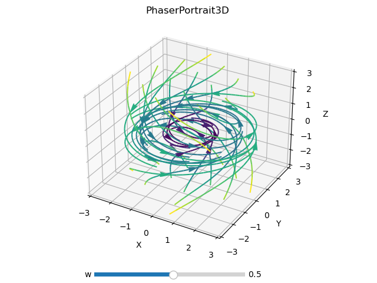

# PhasePortrait3D
*class* phaseportrait.**PhasePortrait3D**(*dF, Range, \*, MeshDim=6, dF_args={}, Density=1, Polar=False, \*\*kargs*)

Gives the option to represent a 3D phase portrait given a [dF](dFfunction.md) function with 3 args.


### **Parameters**

* **dF** : callable

    A dF type funcion. Computes the derivatives of given coordinates.
  
* **Range** : [x_range, y_range, z_range]

    Ranges of the axis in the main plot. See [Defining Range](#defining-range).
  
### **Key Arguments**

* **MeshDim** : int, default=6

    Lattice side used to make lines not intersect. **It has a great impact on performance. We recommend 6~8.**

* **dF_args** : dict

    If necesary, must contain the kargs for the `dF` function.

* **detectLoops** : bool

    If `true` trajectory integration will end when 2 positions closer than `dr`% of lattice side length.

* **dr** : float

    Percentage of lattice length used in loop detection. Only used when `detectLoops==True`.

* **deltat** : float, default=

* **maxLen** : int
    
    Max number of points in every trajectory.


* **Density** : float, default=1

    Number of elements in the arrows grid plot.

* **Polar** : bool, default=False

    Whether to use polar (spherical) coordinates or not.

* **Title** : str, default='Phase Portrait'

    Title of the plot.

* **xlabel** : str, default='X'

    x label of the plot.

* **ylabel** : str, default='Y' 

    y label of the plot.

* **zlabel** : str, default='Z' 

    z label of the plot.

* **color** : str, default='rainbow'

    Matplotlib `Cmap`.

* **xScale** : str, default='linear'

    X axis scale.

* **yScale** : str, default='linear'

    Y axis scale.

* **zScale** : str, default='linear'

    Z axis scale.


# Methods
### *PhasePortrait3D*.plot
> *PhasePortrait3D*.**plot**(*\*, color=None, grid=None*)

Prepares the plots and computes the values.. Color scheme can be changed introducing key argument `color`. A list with accepted values can be found [here](https://matplotlib.org/stable/gallery/color/colormap_reference.html). 

**Returns**

* tuple(matplotlib Figure, matplotlib Axis)


### *PhasePortrait3D*.add_slider
> *PhasePortrait3D*.**add_slider**(*param_name, \*, valinit=None, valstep=0.1, valinterval=10*)

Adds a slider which can change the value of a parameter in execution time.

**Parameters**

* param_name : str

    The string key of the variable. Must be the same as the key in the `dF` function.

**Key Arguments**

* valinit : float, default=None

    Initial value of the parameter.
    
* valinterval : Union[float, list], default=0.1

    The range of values the slider of the parameter will cover.
    
* valstep : float, default=10

    Precision in the slider.

**Returns**

* None


# Defining Range
1. A range, such `[lowerLimit , upperLimit]`.  All three axes will take the same limits.

2. Three ranges, such that `[[xLowerLimit , xUpperLimit], [yLowerLimit , yUpperLimit], [zLowerLimit , zUpperLimit]]`

# Examples

```python
import matplotlib.pyplot as plt
import phaseportrait

# Include streamlines clases to change line styles
from phaseportrait.streamlines import *

def dF(x,y,z, *, w=1):
    return -y, x, -z

example = phaseportrait.PhasePortrait3D(dF, [-3, 3], MeshDim=6, maxLen=2500, deltat=0.1)

example.add_slider('w')
example.Title = "PhaserPortrait3D"

# Change from color proportional to speed to wind like plot
# Default callback is Streamlines_Velocity_Color_Gradient.
# example.streamplot_callback = Streamlines_Size_Gradient
example.plot(color='viridis', grid=True)
plt.show()
``` 

