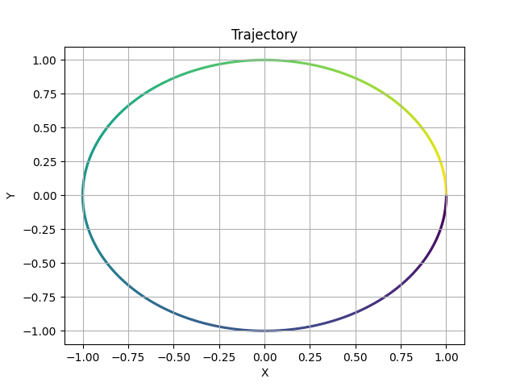
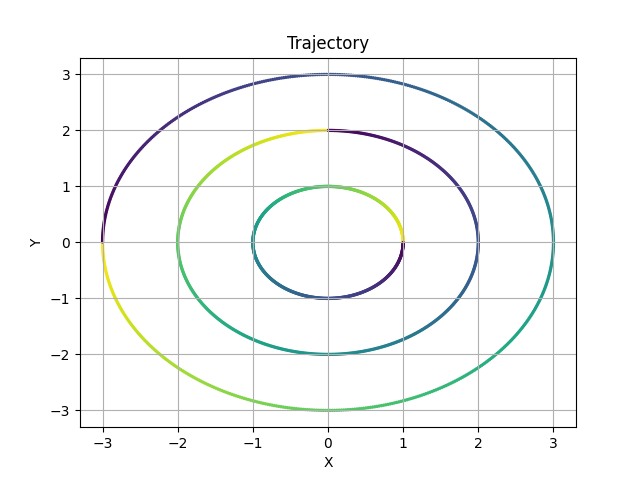
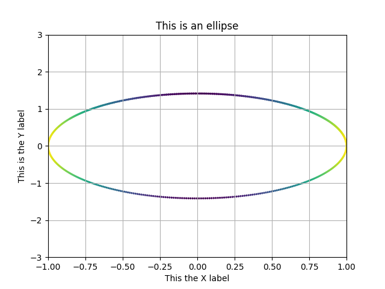
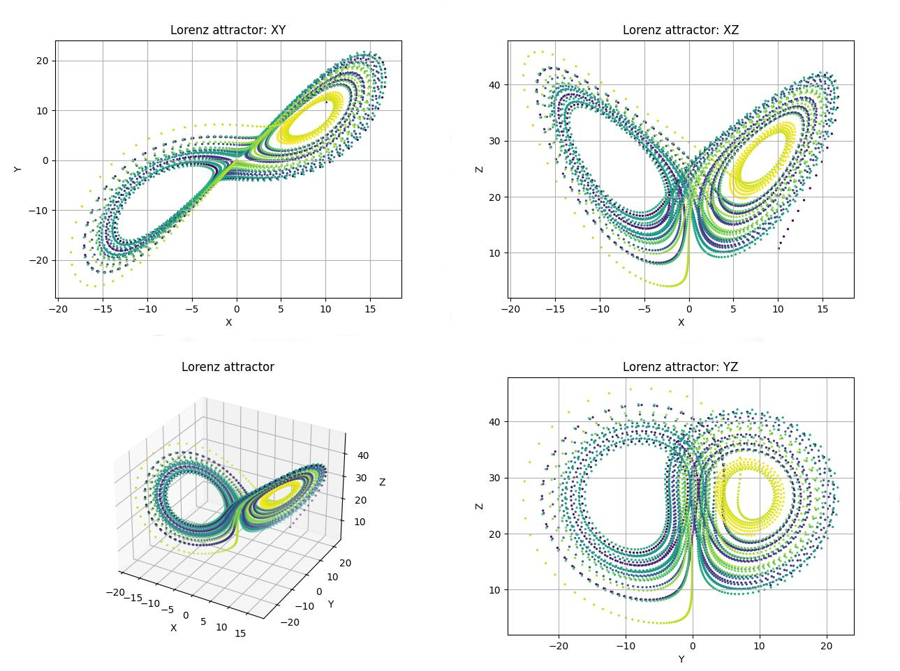
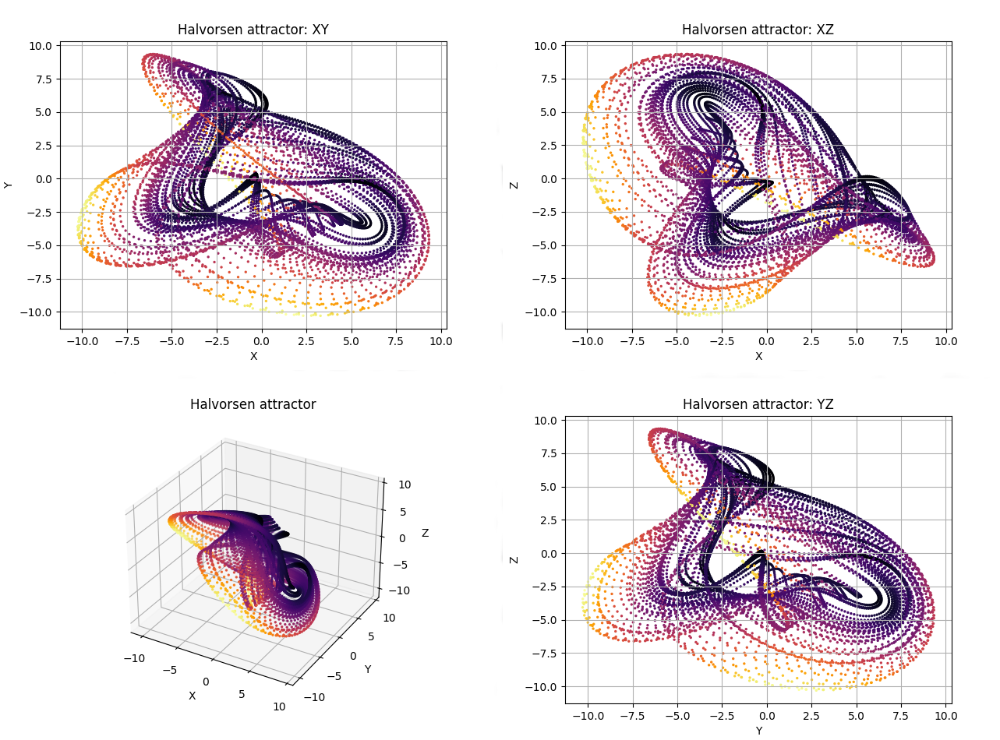

### First steps

In this examples, we will be using [Trajectory2D](trajectory2d.md) and [Trajectory3D](trajectory3d.md) classes. So, we'll have to import them from *phaseportrait* module:

```py
from phaseportrait import Trajectory2D, Trajectory3D
```

Both classes take 1 necessary argument:

* [dF function](dFfunction.md) : a function that, in this case, returns a tuple, corresponding of the evolution of the 2/3 coordinates.


## Trajectory2D

Let's start with an easy example: just a circle.

In order to compute the trajectory you need the amount of points `n_points`, the function `dF`, and initial position `initial_position(x,y)`. In a circle it should look something like this:

```py
def dF(x,y):
    return -y, x

circle = Trajectory2D(dF, n_points=628, size=2)
circle.initial_position(1,0)

circle.plot()
```




## Multiple trajectories

Just add more initial positions:

```py
circles = Trajectory2D(dF, n_points=628, size=2)
circles.initial_position(1,0)
circles.initial_position(0,2)
circles.initial_position(-3,0)

circles.plot()
```



If you want to diferenciate between multiple trajectories use karg `lines=True`, as in the following:


```py
def Lorenz(x,y,z,*, s=10, r=28, b=8/3):
        return -s*x+s*y, -x*z+r*x-y, x*y-b*z

chaos = Trajectory3D(Lorenz, lines=True, n_points=1300, mark_start_position=True, size=3, Title='Nearby IC on Lorenz attractor')
chaos.initial_position(10,10,10)
chaos.initial_position(10,10,10.0001)
chaos.plot()
```


## Ranges, title, labels and colormaps

Ranges can be defined in several ways.

1. A single number. In this case the range is defined from zero to the given number in all axes.

2. A range, such `[lowerLimit , upperLimit]`. All axes will take the same limits.

3. Three ranges, such that `[[xAxisLowerLimit , xAxisUpperLimit], [yAxisLowerLimit , yAxisUpperLimit], [zAxisLowerLimit , zAxisUpperLimit]]`

Title and labels with the kargs: `Title`, `xlabel`, `ylabel` and `zlabel`.
For example:

```py
def dF(x,y, *, w=2):
    return -y, w*x

example = Trajectory2D(dF, n_points=628, Range=[[-1,1],[-3,3]], size=2, Title='This is an ellipse', xlabel='This the X label', ylabel='This is the Y label')
example.initial_position(1,0)

example.plot()
```



Colormap expresses the velocity of the trajectory, it can be changed with `color` kwarg. Default colormap is `'viridis'`, in which purple-shifted colors indicate less velocity than yellow-shifted colors. A list with accepted values can be found [here](https://matplotlib.org/stable/gallery/color/colormap_reference.html). 

An also valid value is `t`, which will represent the colors as the evolution in time of the trajectory, according to `viridis` cmap. Using karg `color` when calling plot method permits changing the colormap to another.

## Numba

[Numba](http://numba.pydata.org/) can be used to compute trajectories. To use it, give `numba=True` as kwarg. When using Numba, `dF_args` karg is compulsory. For instance:

```py 
def Lorenz(x,y,z,*, s=10, r=28, b=8/3):
    return -s*x+s*y, -x*z+r*x-y, x*y-b*z

Lorentz_plot = Trajectory3D(Lorenz, dF_args={'s':10, 'r':28, 'b':8/3}, color='t', n_points=4000, numba=True, size=2, Title='Lorenz attractor')
Lorentz_plot.initial_position(10,10,10)
Lorentz_plot.plot()
```



## Thermalization

If you want to see an attractor you should discard the initial points. In order to do that use karg `thermalization=N` where N is the number of points calculated and rejected. Just like this:

```py
def Halvorsen(x,y,z, *, s=1.4):
    delta = (3*s+15)
    return -s*x + 2*y - 4*z - y**2 + delta , -s*y + 2*z - 4*x - z**2 + delta, -s*z + 2*x - 4*y - x**2 + delta

attractor1 = Trajectory3D(Halvorsen, dF_args={'s':1.4}, n_points=10000, thermalization=500, numba=True, size=2, Title='Halvorsen attractor')
attractor1.initial_position(0,5,10)
attractor1.plot(color='inferno')
```

Or you can use the method `thermalize`, then the initial position taken will be random.

```py
def Halvorsen(x,y,z, *, s=1.4):
    delta = (3*s+15)
    return -s*x + 2*y - 4*z - y**2 + delta , -s*y + 2*z - 4*x - z**2 + delta, -s*z + 2*x - 4*y - x**2 + delta

attractor1 = Trajectory3D(Halvorsen, dF_args={'s':1.4}, n_points=10000, numba=True, size=2, Title='Halvorsen attractor')
attractor1.thermalize(thermalization_steps=1000)
attractor1.plot(color='inferno')
```




## Sliders

This method allows the user to modify the `dF_args` in the plot, so it is easier to visualize interesting behaviours.

To use them the user must declare the specific name of the karg. Initial value, range of values and step between selectionable consecutive values are optional. 

```py
def Aizawa(x,y,z,*, a=0.95, b=0.7, c=0.6, d=3.5, e=0.25, f=0.1):
    return (z-b)*x - d*y, d*x + (z-b)*y, c + a*z - z*z*z/3 - (x*x + y*y) * (1 + e*z) + f*z*x*x*x

attractor2 = Trajectory3D(Aizawa, n_points=10000, size=1, thermalization=2000, Title='Aizawa attractor')
attractor2.thermalize()
attractor2.add_slider('a', valinit=0.95, valinterval=[0,1], valstep=0.005)
attractor2.add_slider('b', valinit=0.7, valinterval=[0,1], valstep=0.005)
attractor2.add_slider('c', valinit=0.6, valinterval=[0,1], valstep=0.005)
attractor2.add_slider('d', valinit=3.5, valinterval=[0,4], valstep=0.05)
attractor2.add_slider('e', valinit=0.24, valinterval=[0,1], valstep=0.005)
attractor2.add_slider('f', valinit=0.1, valinterval=[0,1], valstep=0.005)
attractor2.plot()
```


We've taken a look to the most important arguments in order to visualize trajectories. Nevertheless, trajectory classes have more features that can be seen by taking a look into the docs:

*   [Trajectory2D](trajectory2d.md)
*   [Trajectory3D](trajectory3d.md)
*   [trajectory](trajectory.md)


# Some more examples

If you want to take a look to some more 'elaborated' plots, we recommend you taking a look to the [following file](https://github.com/phaseportrait/phaseportrait/blob/master/examples/TrajectoryExamples.py), in which you cand find several famous chaotic attractors.