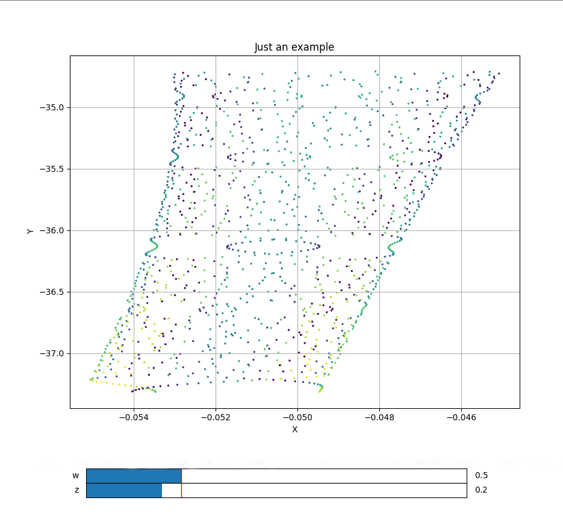

# Trajectory2D
> *class* phaseportrait.**Trajectory2D**(*dF, \*, Range=None, dF_args={}, n_points=10000, runge_kutta_step=0.01, runge_kutta_freq=1, \*\*kargs*)

Inherits from parent class [trajectory](trajectory.md).

Computes a trajectory on a 2D system given a [dF](dFfunction.md) function consisting of 2 args.


### **Parameters**

* **dF** : callable

    A dF type function.

### **Key Arguments**

* **Range** : list

    Ranges if the axis in the main plot, by default None. See [Defining Range](#defining-range).

* **dF_args** : dict

    If necesary, must contain the kargs for the `dF` function, by default {}

* **n_points** : int

    Maximum number of points to be calculated and represented, by default 10000

* **runge_kutta_step** : float

    Step of 'time' in the Runge-Kutta method, by default 0.01

* **runge_kutta_freq** : int

    Number of times `dF` is aplied between positions saved, by default 1

* **xlabel** : str

    x label of the plot, by default 'X'

* **ylabel** : str

    y label of the plot, by default 'Y'

# Methods

Inherits methods from parent class [trajectory](trajectory.md), a brief resume is offered, click on the method to see more information:

* [thermalize](../trajectory/#methods) :

    Adds thermalization steps and random initial position.
        
* [initial_position](../trajectory/#methods) :

    Adds a trajectory with the given initial position.
    
* [plot](../trajectory/#methods) : 

    Prepares the plots and computes the values. 
    Returns the axis and the figure.
    
* [add_slider](../trajectory/#methods) :

    Adds a slider for the dF function.

# Defining Range

1. A single number. In this case the range is defined from zero to the given number in both axes.

2. A range, such `[lowerLimit , upperLimit]`.  Both axes will take the same limits.

3. Two ranges, such that `[[xAxisLowerLimit , xAxisUpperLimit], [yAxisLowerLimit , yAxisUpperLimit]]`

# Examples
```python
from phaseportrait import Trajectories2D
import numpy as np

def dF(x,y,*, w=1, z=1):
    return w*np.sin(y*y*y), -z*np.exp(x*x)

example = Trajectory2D(dF, n_points=1300, size=2, mark_start_position=True, Title='Just an example')
example.initial_position(1,1)
example.add_slider('w', valinterval=[-1,5])
example.add_slider('z', valinterval=[-1,5])
example.plot()
plt.show()

```
